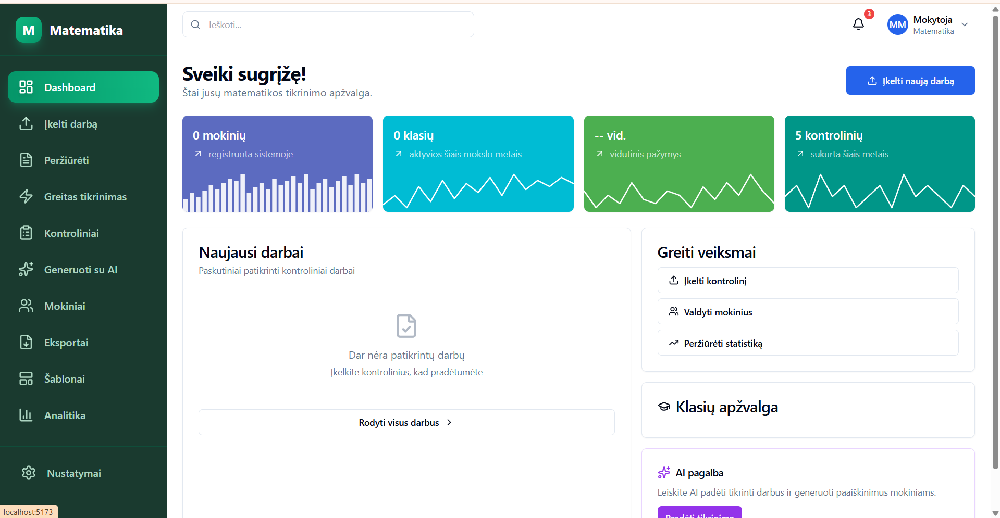
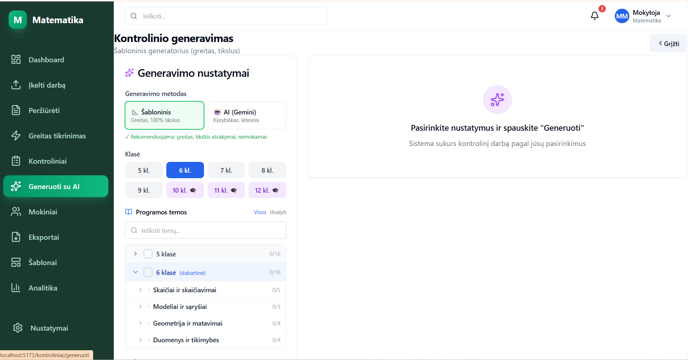
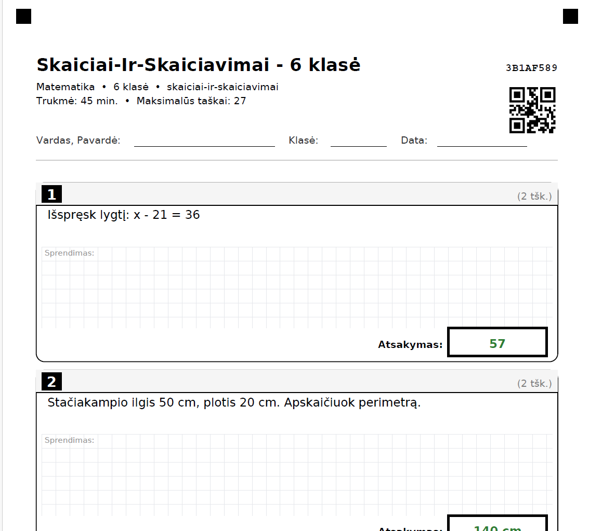
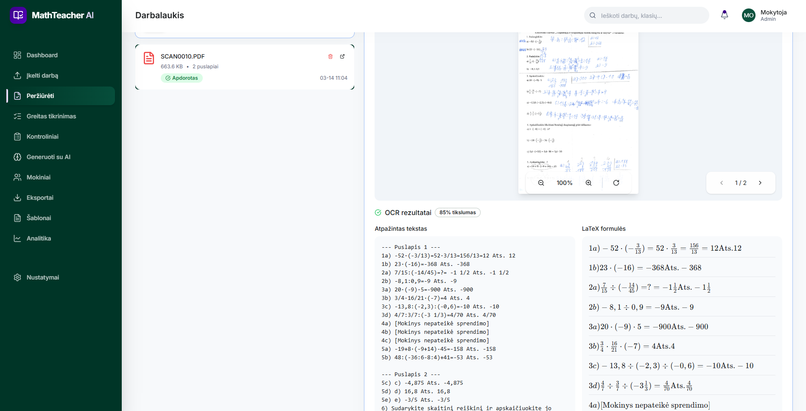
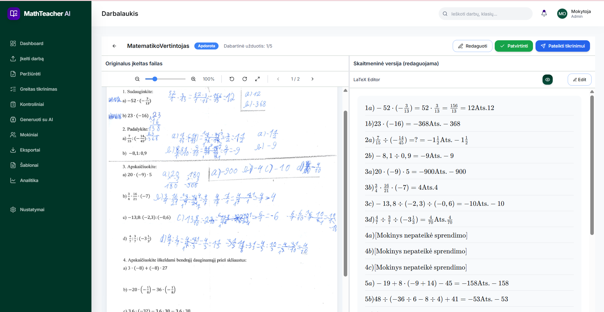
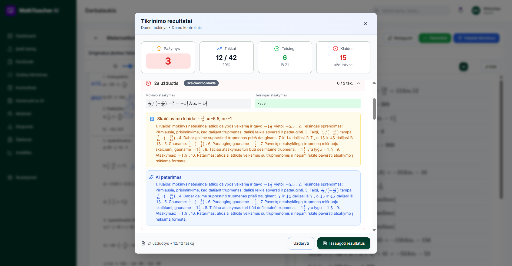

# 🧮 Math Teacher Assistant / Matematikos Mokytojo Asistentas

[](LICENSE)
[](https://www.python.org/downloads/)
[](https://react.dev/)
[](https://github.com/olandasf/math-assistant)

**An open-source, AI-powered platform that automates the complete exam lifecycle for math teachers — from curriculum-aligned exam generation through handwritten student work recognition to AI-verified grading with personalized explanations.** Designed specifically for the Lithuanian education system (grades 5–12), fully localized in Lithuanian.

**Atvirojo kodo, DI pagrindu veikianti platforma, automatizuojanti visą kontrolinio darbo ciklą matematikos mokytojams — nuo kontrolinių generavimo pagal programą iki ranka rašytų mokinių darbų atpažinimo ir DI patvirtintų įvertinimų su individualizuotais paaiškinimais.** Sukurta specialiai Lietuvos švietimo sistemai (5–12 klasėms), pilnai lokalizuota lietuvių kalba.

---

## 🔄 How it works / Kaip tai veikia

The system creates a **closed-loop workflow** where exam generation and grading are tightly integrated — exams are specifically designed to maximize AI recognition accuracy of handwritten student work.

Sistema sukuria **uždarą darbo ciklą**, kuriame kontrolinių generavimas ir tikrinimas yra glaudžiai integruoti — kontroliniai specialiai kuriami taip, kad DI kuo tiksliau atpažintų ranka rašytus mokinių darbus.

```
┌─────────────────────────────────────────────────────────────────────┐
│                        CLOSED-LOOP WORKFLOW                        │
│                                                                    │
│  1. SETUP          2. GENERATE         3. PRINT & WRITE            │
│  ┌──────────┐     ┌──────────────┐     ┌──────────────────┐        │
│  │ Classes  │────▶│ Exam sheets  │────▶│ Students solve   │        │
│  │ Curriculum│    │ (OCR-ready   │     │ on structured    │        │
│  │ Topics   │    │  PDF + QR)   │     │ PDF forms        │        │
│  └──────────┘     └──────────────┘     └────────┬─────────┘        │
│                                                  │                  │
│  6. FEEDBACK       5. VERIFY           4. SCAN & RECOGNIZE         │
│  ┌──────────────┐ ┌──────────────┐     ┌──────────────────┐        │
│  │ AI explains  │◀│ SymPy +      │◀────│ AI Vision OCR    │        │
│  │ errors in LT │ │ WolframAlpha │     │ (multi-provider) │        │
│  │ + PDF report │ │ math check   │     │ handwriting →    │        │
│  └──────────────┘ └──────────────┘     │ LaTeX + text     │        │
│                                         └──────────────────┘        │
└─────────────────────────────────────────────────────────────────────┘
```

### Step 1: Curriculum Setup / Programos paruošimas

Teachers create classes and the system loads the **official Lithuanian math curriculum** approved by the Ministry of Education — organized by grade (5–12), topics, subtopics, difficulty levels, and competency types. This includes both text-based and computational problems.

Mokytojai sukuria klases, o sistema įkelia **oficialią Lietuvos švietimo ministerijos patvirtintą matematikos programą** — suskirstytą pagal klases (5–12), temas, potemes, sunkumo lygius ir kompetencijų tipus. Tai apima tiek tekstinius, tiek skaičiavimo uždavinius.

> 🚧 **In progress:** Building a comprehensive problem database properly mapped to curriculum topics, difficulty levels, and competency standards. This is a significant undertaking that will greatly improve generation quality.

### Step 2: Exam Generation / Kontrolinių generavimas

Teachers select class, topics, difficulty level, number of problems, and number of variants. The system generates exams using two methods:

- **Template generator** — algorithmic, 3490-line engine with mathematically verified answers and correct Lithuanian grammar declensions
- **AI generator** — Gemini AI creates contextual word problems aligned to curriculum

The generated exams use a **specially designed OCR-optimized PDF format** with:
- ✅ QR codes for automatic identification
- ✅ Alignment markers (corner squares) for scan processing
- ✅ Structured answer boxes that guide students to write neatly
- ✅ Solution areas with grid lines
- ✅ Teacher variant with correct answers (planned: with full solution steps)

**This intentional design is key** — the structured format encourages neater handwriting, which directly improves AI handwriting recognition accuracy during grading.

Mokytojai pasirenka klasę, temas, sunkumo lygį, uždavinių ir variantų kiekį. Sistema generuoja kontrolinius dviem būdais: šabloniniu generatoriumi (algoritminis, su tiksliais atsakymais ir teisingais lietuvių kalbos linksniais) ir DI generatoriumi (Gemini AI kuria kontekstinius tekstinius uždavinius). Sugeneruoti kontroliniai naudoja **specialiai sukurtą OCR-optimizuotą PDF formatą** su QR kodais, alignment markeriais, struktūrizuotomis atsakymų dėžutėmis ir sprendimo zonomis — tai skatina mokinius rašyti tvarkingiau, o tai tiesiogiai gerina DI rašysenos atpažinimo tikslumą.

### Step 3–4: Scanning & Recognition / Skenavimas ir atpažinimas

Completed student work is scanned and processed by **multi-provider AI Vision OCR**:
- **Gemini Vision** / **OpenAI Vision** / **Novita Vision** (Qwen) / **Together.ai** (Qwen, Llama)
- Handles cross-outs, column calculations, mixed handwriting
- Outputs structured text + LaTeX formulas
- When a specific exam is selected for grading, the system already knows the correct answers — further increasing accuracy

### Step 5–6: Verification & Feedback / Tikrinimas ir grįžtamasis ryšys

Mathematical verification uses a **4-tier hierarchy**: SymPy → Newton API → WolframAlpha → Gemini AI. Each student receives AI-generated explanations of their errors **in Lithuanian**, with concrete step-by-step solutions.

---

## 🔮 Roadmap / Planuojamos funkcijos

| Status | Feature | Description |
|--------|---------|-------------|
| ✅ | Exam grading | AI Vision OCR + Math verification + AI explanations |
| ✅ | Exam generation | Template + AI generation with OCR-optimized PDF |
| 🚧 | Problem database | Comprehensive problem bank mapped to curriculum topics |
| 🚧 | Solution steps | Teacher variant with full solution methods, not just answers |
| 📋 | Lesson slides | Interactive teaching materials / slide preparation for lessons |

---

## 📸 Screenshots / Ekranvaizdžiai

### Dashboard / Pradinis puslapis


### Exam Generation / Kontrolinio generavimas


### Generated Exam Sheet / Sugeneruotas kontrolinio lapas


### AI Vision OCR — Handwriting Recognition / Rašysenos atpažinimas


### LaTeX Editor — Side-by-side Review / Peržiūra su LaTeX


### Grading Results with AI Explanations / Tikrinimo rezultatai su DI paaiškinimais


---

## ✨ Key Features / Pagrindinės funkcijos

| Feature | Description |
|---------|-------------|
| 📷 **AI Vision OCR** | Recognizes handwritten student work — handles cross-outs, column calculations, mixed content |
| ✅ **Math verification** | SymPy → Newton API → WolframAlpha → Gemini AI (4-tier hierarchy) |
| 💬 **Error explanations** | AI explanations in Lithuanian with concrete solution steps |
| 📝 **Exam generation** | Based on official Lithuanian math curriculum, two generation methods |
| 📄 **OCR-optimized PDF** | Exam sheets with QR codes, alignment markers, structured answer boxes |
| 📚 **Problem bank** | ~870K problems from HuggingFace + algorithmic generator with Lithuanian grammar |
| 🇱🇹 **Localization** | Automatic EN→LT translation with cultural adaptation (names, currency, units) |
| 📊 **Reports** | PDF with grades, error statistics, recommendations |
| 🔢 **LaTeX rendering** | Side-by-side KaTeX rendering for math expression review |
| 🤖 **Multi-provider OCR** | Gemini, OpenAI, Novita (Qwen), Together.ai — selectable with model dropdowns |

---

## 🛠️ Tech Stack

### Backend
| Component | Technology |
|-----------|------------|
| Framework | Python 3.11, FastAPI, Uvicorn |
| Database | SQLAlchemy 2.0, SQLite (aiosqlite) |
| Math | SymPy, Newton API, WolframAlpha |
| OCR | Gemini Vision, OpenAI Vision, Novita Vision (Qwen), Together.ai (Qwen, Llama) |
| AI | Google Gemini (explanations, generation, localization) |
| PDF | ReportLab (exam sheets), QR codes |
| Migrations | Alembic |

### Frontend
| Component | Technology |
|-----------|------------|
| Framework | React 18, TypeScript, Vite |
| UI | TailwindCSS, shadcn/ui, Radix UI |
| Math rendering | KaTeX, react-katex |
| Charts | Recharts, Lucide icons |
| HTTP | Axios |

### Data Sources
| Source | Description |
|--------|-------------|
| Lithuanian curriculum | 8 JSON files (grade_5..12.json) — official math program |
| GSM8K | 8,500 word problems (grades 6-8) |
| Competition Math | Olympiad problems (grades 10-12) |
| NuminaMath-CoT | ~860K olympiad problems with Chain of Thought (grades 8-12) |
| MathInstruct | ~260K instruction-format problems (grades 6-12) |

---

## 📁 Project Structure

```
├── backend/
│   ├── routers/          ← 14 API endpoints (classes, students, tests, OCR, ...)
│   ├── models/           ← 15 SQLAlchemy models
│   ├── services/
│   │   ├── ocr/          ← AI Vision OCR (Gemini, OpenAI, Novita, Together.ai)
│   │   ├── test_generator.py       ← Exam generation (2107 lines)
│   │   ├── math_problem_bank.py    ← Algorithmic generator (3490 lines)
│   │   ├── huggingface_loader.py   ← HuggingFace dataset loader
│   │   ├── task_translator.py      ← EN→LT localization
│   │   └── exam_sheet_generator.py ← PDF exam sheets (1284 lines)
│   ├── utils/
│   │   ├── curriculum.py           ← Lithuanian math curriculum
│   │   ├── curriculum_loader.py    ← JSON curriculum loader
│   │   └── topics.py              ← 48 math topics
│   └── math_checker/     ← SymPy + WolframAlpha + Newton API
├── frontend/
│   ├── src/pages/         ← Dashboard, Classes, Tests, Upload, Review, ...
│   ├── src/components/    ← UI components (shadcn/ui)
│   └── src/api/           ← API services
├── Matematikos programa/  ← JSON curriculum files by grade (5-12)
├── docs/                  ← Documentation + screenshots
├── database/              ← SQLite DB (not tracked)
├── uploads/               ← Student work uploads (not tracked)
└── exports/               ← Generated reports (not tracked)
```

---

## 🚀 Quick Start

### Prerequisites
- Python 3.11+
- Node.js 18+
- API keys: Gemini (required), WolframAlpha (recommended)

### One-command launch (Windows)

```bash
START.bat
```

This automatically installs dependencies, initializes the database, and launches both backend and frontend.

### Manual setup

#### Backend

```bash
cd backend
python -m venv venv
source venv/bin/activate  # Windows: .\venv\Scripts\Activate
pip install -r requirements.txt
cp ../.env.example ../.env  # Edit with your API keys
alembic upgrade head
uvicorn main:app --reload
```

#### Frontend

```bash
cd frontend
npm install
npm run dev
```

### Configuration

Copy `.env.example` to `.env` and fill in API keys:

```env
GEMINI_API_KEY=your_key_here          # Required - Google AI Studio
WOLFRAM_APP_ID=your_app_id_here       # Recommended - 2000 free/month
```

Additional OCR provider API keys (OpenAI, Novita, Together.ai) are configured through the in-app settings UI with model selection dropdowns.

---

## 📋 Why AI Vision instead of traditional OCR?

Students (grades 5–12) produce **messy handwriting**: cross-outs, corrections, column calculations, drawings mixed with formulas. Traditional OCR solutions (Tesseract, Google Cloud Vision, MathPix) fail at:

- Distinguishing cross-outs from final answers
- Understanding column long division
- Recognizing Lithuanian format ("Ats.", "Nr.", "Sprendimas:")

**AI Vision models** (Gemini, OpenAI, Novita, Together.ai) are multimodal — they understand **context**, not just symbols. Details: [`docs/OCR_ARCHITECTURE.md`](docs/OCR_ARCHITECTURE.md).

---

## 🔒 Security Notes

- 🔐 API keys stored in SQLite database (encryption recommended for production)
- 📛 Student names anonymized before sending to AI APIs
- 🚫 Authentication not yet implemented (development mode)
- 📄 GDPR compliant — personal data is never sent to third-party servers unmodified

---

## 🤝 Contributing

Contributions are welcome! Please see the [docs/](docs/) directory for technical specifications.

---

## 📄 License

This project is licensed under the MIT License — see the [LICENSE](LICENSE) file for details.

---

*Last updated: 2026-03-15*
